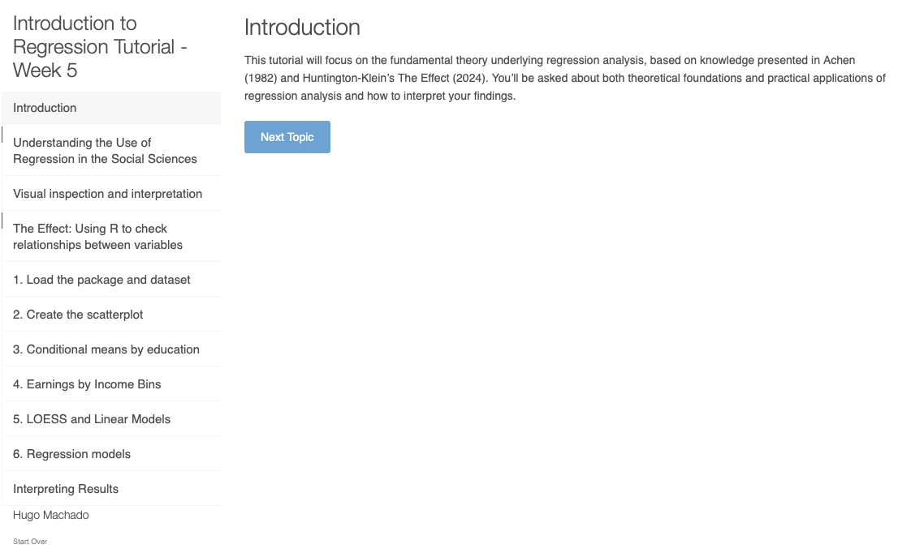

## Filosofia de Ensino

Minha abordagem de ensino combina o conhecimento teórico sobre ensino e aprendizagem com aplicações práticas que visam aumentar o engajamento e o aprendizado dos alunos. Com o uso de ferramentas interativas e atividades dinâmicas, consigo ajudar os alunos a visualizar e trabalhar conteúdos complexos de forma mais eficaz. Acredito na criação de ambientes de aprendizagem acolhedores, onde alunos com diferentes perfis e habilidades possam desenvolver suas competências técnicas e pensamento crítico. Para uma visão mais abrangente da minha experiência docente, por favor, consulte a aba do CV para uma descrição atualizada.

## Ferramentas Interativas de Ensino

Desenvolvi uma série de tutoriais interativos usando Shiny para minha atuação como assistente de ensino em métodos de regressão. Esses aplicativos oferecem experiências práticas de aprendizagem que complementam os formatos tradicionais de aula e ajudam a consolidar conceitos estatísticos abstratos.

### Tutorial em Destaque:

Este aplicativo interativo permite que os alunos explorem os fundamentos da análise de regressão, incluindo pressupostos, interpretação de coeficientes e diagnósticos.

[Acessar o Tutorial de Análise de Regressão](https://hmachado.shinyapps.io/week5/){.btn .btn-primary target="_blank"}